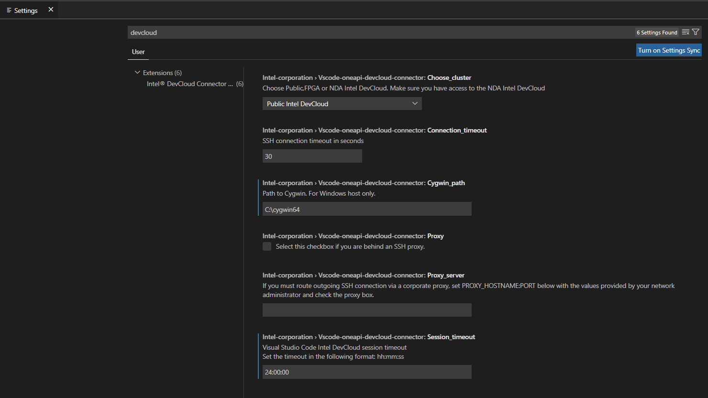
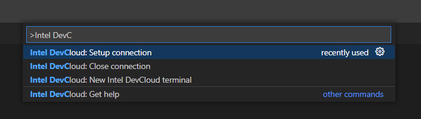
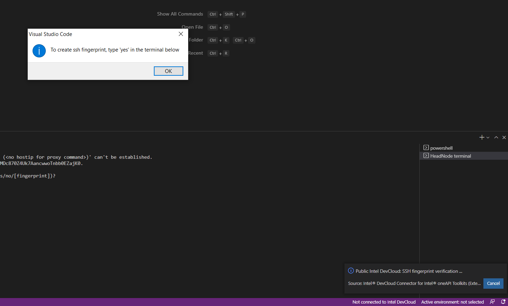
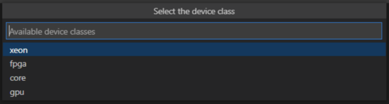
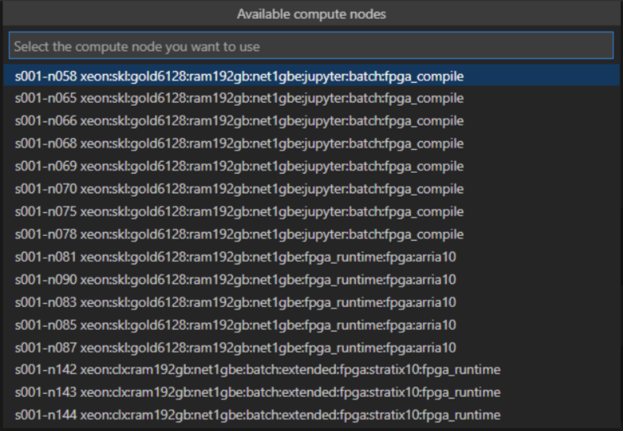

# Intel® DevCloud Connector for Intel® oneAPI Toolkits

#### | [Repository][vsix-repo] | [Issues and Known Bugs][vsix-issues] | [Documentation][vsix-docs] | [Forum][vsix-forum] |

[vsix-repo]:   <https://github.com/intel/vscode-oneapi-devcloud-connector>
[vsix-issues]: <https://github.com/intel/vscode-oneapi-devcloud-connector/issues>
[vsix-docs]:   <https://github.com/intel/vscode-oneapi-devcloud-connector#readme>
[vsix-forum]:  <https://community.intel.com/t5/Intel-DevCloud/bd-p/devcloud>

#### | [oneAPI Code Samples][oneapi-samples] | [oneAPI VS Code Extensions][oneapi-extensions] | [Intel VS Code Extensions][intel-extensions] |

[oneapi-samples]:    <https://github.com/oneapi-src/oneAPI-samples>
[oneapi-extensions]: <https://marketplace.visualstudio.com/search?term=oneapi&target=VSCode>
[intel-extensions]:  <https://marketplace.visualstudio.com/publishers/intel-corporation>

***

This extension assists with configuring and establishing a Visual Studio Code* (VS Code) Remote-SSH
connection to the [Intel DevCloud](https://devcloud.intel.com/oneapi/)
development environment.

The Intel DevCloud cluster does not support VS Code Remote-SSH connections
into the cluster's "login node." However, by creating an SSH tunnel you can
establish a VS Code Remote-SSH session with a Intel DevCloud "compute node."
This extension will help you locate and reserve a compute node and establish
an interactive VS Code Remote-SSH session with that compute node. You can also
work with the command line by establishing a connection to a compute node then
using the "Intel DevCloud Terminal" feature in this extension.

***

## Prerequisites:

* Windows* 10 or Linux* Ubuntu* 18.04/20.04 (currently tested platforms).

* Install [VS Code](https://code.visualstudio.com/download) 1.64.0 or later and install the [Remote-SSH
extension](https://marketplace.visualstudio.com/items?itemName=ms-vscode-remote.remote-ssh).

* Create a Intel [DevCloud account](https://devcloud.intel.com/oneapi/home/) and [download setup-devcloud-access-\<user\>.txt script](https://devcloud.intel.com/oneapi/documentation/connect-with-ssh-windows-cygwin/#configure-ssh-connection).

* Cygwin* is required for the Windows system. The extension will automatically install Cygwin during the first connection.

* Turn off your VPN (connecting via a VPN is not supported).

## Using the Extension

### Check the extension settings

*  If you are behind an SSH Proxy, add your proxy name and port, and check the
   proxy box. The proxy is only applied if the checkbox is selected.

*  Change the SSH connection timeout and the Visual Studio Code session timeout
   if needed.

* Select the cluster to which you want to connect in the "Choose_cluster" section. You can select Public (selected by default), FPGA or NDA. If you select an NDA, make sure you have access.

### Setup Connection

1. Press `Ctrl+Shift+P ( or View -> Command Palette... )` to open the Command Palette.
2. Type **Intel DevCloud** and select `Intel DevCloud: Setup connection`

   

3. If Cygwin is not present on the Windows system, the extension will prompt
   you to automatically install it.

   After installing Cygwin, run the command `Intel DevCloud: Setup connection` again.

4. If an ssh config file is not present, the extension will prompt you to
   create it using the downloaded setup-devcloud-access-\<user\>.txt script.

5. During the first connection, the extension will ask to create an SSH
   fingerprint and open terminal. Type "yes" in the terminal to create the
   fingerprint.
   
   

6. During the connection process, you will be prompted to select the compute node properties.
   
   First, you will be prompted to select a device class ( core, xeon, gpu, fpga). 
   
   
   Then the compute node from the selected class
   

7. Wait for the connection process to finish.

   > NOTE: A service terminal named `devcloudService` will be created. This is the terminal that is used to facilitate your connection to the Intel DevCloud. Do not close the terminal until you are ready to disconnect from the Intel DevCloud.

8. If the connection setup is successful, Remote-SSH window will open and be
  connected to a compute node.

9. To run the Intel DevCloud compute node terminal, open a new terminal in the
  Remote-SSH window
  
   or type `Ctrl+Shift+P`  and select `Intel DevCloud: New Intel DevCloud Terminal`

  The Intel DevCloud terminal can now build and run samples using the command line.
  For instructions on how to build and run samples, see the
  [Intel DevCloud Get Started](https://devcloud.intel.com/oneapi/get_started/),
  or [browse samples on GitHub](https://github.com/oneapi-src/oneAPI-samples).

* For access to Intel DevCloud documentation, type `Ctrl+Shift+P` to open the
  Command Palette, type **Intel DevCloud** and select `Intel DevCloud: Get Help`.

### End the Connection

  To close your connection to the Intel DevCloud and kill your session:

* Press `Ctrl+Shift+P ( or View -> Command Palette... )` to open the Command Palette.
 Type **Intel DevCloud** and select `Intel DevCloud: Close connection`

  or

* Close the Visual Studio Code window that is running the Intel DevCloud extension and Remote-SSH window.

## Known issues

* The extension successfully connects to Intel DevCloud, but Remote-SSH window can't establish a connection.

  In this case, try to restart the OS on your host system.

## License
This extension is released under the MIT License.

*Other names and brands may be claimed as the property of others.

